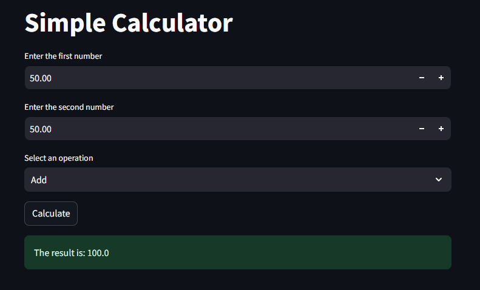
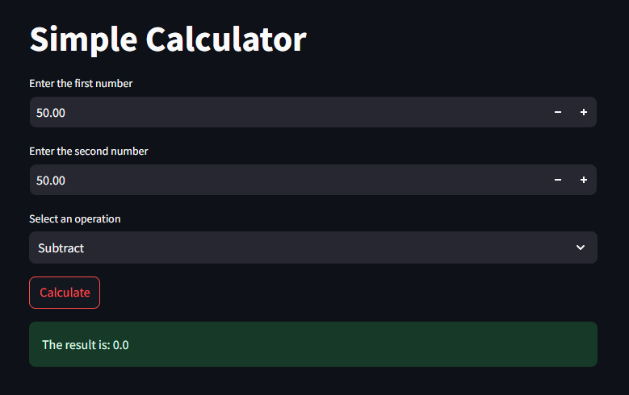
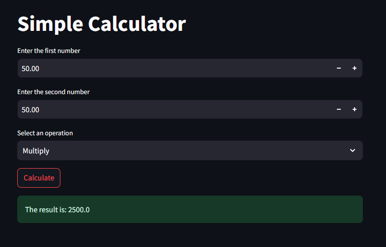
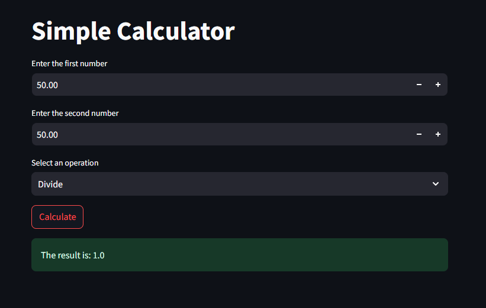

# Specification

## 1. /sp.constitution
In this step, we define the purpose of the project. Our project goal is to create a simple calculator using SPECKit Plus, where the coding will be generated through Gemini CLI. We clarify the vision, boundaries, and main functions the calculator must achieve.

## 2. /sp.specify
Here, we write the exact requirements of the calculator. The calculator should perform basic operations like addition, subtraction, multiplication, and division. The inputs will be numbers, and the output should show the correct result for each operation.

## 3. /sp.plan
In planning, we outline how the system will be built. We decide the structure: user input → operation selection → processing → output. We also plan the command prompts Gemini CLI will use to generate the required code during development.

## 4. /sp.task
Next, we break the project into tasks. Tasks include creating the input handling, defining each math function, implementing operation logic, testing each function, and finally assembling everything into a working calculator. Each task will be executed step-by-step.

## 5. /sp.implementation
In this step, we bring the plan to life. We will use Gemini CLI commands to generate code for the calculator functions and combine them into a final working program. After implementation, we test the calculator to ensure all operations work correctly.

## ADD

## SUBTRACT

## MULTIPLE

## DIVIDE
